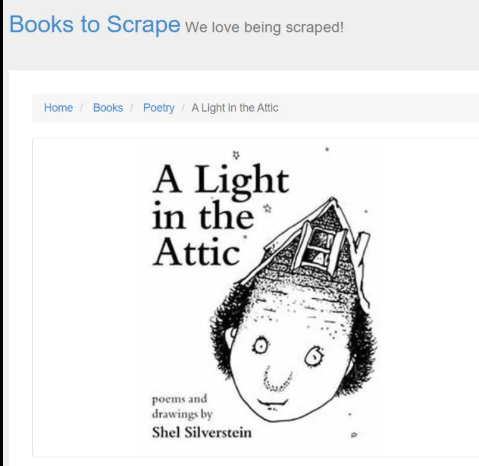

## Web Scraping Projects Collection
# Hello! Thank you for visiting my README 😊

**This repository is a collection of my web scraping projects built using Python and BeautifulSoup.**

# 1. Quotes to Scrape - Web Scraping Project

## Description

This project is a Python-based web scraper that extracts quotes, authors, tags, and author profile links from Quotes to Scrape.
It demonstrates how to scrape multi-page data and store it in a structured format for analysis.

## Features

* Scrapes quotes from multiple pages (1–10)
* Extracts quote text and author names
* Collects tags associated with each quote
* Retrieves author profile links
* Stores data in CSV format

##  Tech Stack

* Python
* Requests
* BeautifulSoup
* Pandas

##  How It Works

* Sends HTTP requests to each page of the website
* Parses HTML using BeautifulSoup
* Extracts data using class selectors
* Uses a loop to handle pagination
* Stores extracted data in a list
* Converts data into a Pandas DataFrame
* Exports the data to a CSV file

##  Output

The script generates a file named **quotes.csv** containing:

* Quotes
* Author
* Author_link
* Tags

# 2. Hacker News Scraper - Web Scraping Project

##  Description

This project is a Python-based web scraper that extracts articles, upvotes, authors, comments, and posting time from Hacker News.
It demonstrates how to scrape real-time tech news data and convert it into a structured dataset.

## Features

* Extracts article titles and links
* Collects upvotes (points) for each article
* Retrieves author names
* Captures posting time
* Extracts number of comments
* Handles missing data using exception handling
* Stores data in CSV format

## Tech Stack

* Python
* Requests
* BeautifulSoup
* Pandas

##  How It Works

* Sends an HTTP request to the Hacker News homepage
* Parses HTML using BeautifulSoup
* Extracts article details using class selectors
* Handles missing values using try-except blocks
* Stores data in a list of dictionaries
* Converts data into a Pandas DataFrame
* Exports the dataset to a CSV file

##  Output

The script generates a file named **articles_list.csv** containing:

* Article Name
* Link
* Upvotes
* Author
* Time Posted
* Comments Count

# 3. Fake Jobs Scraper - Web Scraping Project

##  Description

This project is a Python-based web scraper that extracts job listings from Real Python Fake Jobs.
It collects structured job data for analysis and practice purposes.

##  Features

* Extracts job titles
* Collects company names
* Retrieves job locations
* Captures posting time
* Extracts footer details and links
* Handles missing data using exception handling
* Stores data in CSV format

##  Tech Stack

* Python
* Requests
* BeautifulSoup
* Pandas

##  How It Works

* Sends an HTTP request to the website
* Parses HTML using BeautifulSoup
* Extracts job-related information using class selectors
* Handles missing values using try-except blocks
* Stores extracted data in a list of dictionaries
* Converts it into a Pandas DataFrame
* Saves the data into a CSV file

##  Output

The generated dataset contains:

* Title
* Company
* Location
* Time
* Footer
* Footer Link

# 4. Books to Scrape - Web Scraping Project

##  Description

This project is a Python-based web scraper that extracts book details such as name, price, and product links from Books to Scrape.
It is designed to practice scraping structured product data from an e-commerce-style website.

##  Features

* Extracts book names
* Collects product links
* Retrieves book prices
* Handles multiple items from the page
* Stores data in CSV format

##  Tech Stack

* Python
* Requests
* BeautifulSoup
* Pandas

##  How It Works

* Sends an HTTP request to the website
* Parses HTML using BeautifulSoup
* Extracts book details using class selectors
* Stores data in a list of dictionaries
* Converts data into a Pandas DataFrame
* Exports the data into a CSV file

##  Output

The generated dataset contains:

* Name
* Link
* Price

# 5. Love & Flair Scraper - Web Scraping Project

##  Description

This project is a Python-based web scraper that extracts product data from Love & Flair.
It collects detailed information about activewear products including pricing, availability, colors, sizes, and materials.

##  Features

* Scrapes product links from multiple pages (pagination)
* Extracts product names and prices
* Retrieves stock availability
* Collects available colors and sizes
* Extracts product material information
* Handles missing data using conditional logic
* Stores structured data in CSV format

##  Tech Stack

* Python
* Requests
* BeautifulSoup
* Pandas

##  How It Works

* Sends HTTP requests to multiple product listing pages
* Extracts product links using HTML class selectors
* Removes duplicate links using set()
* Visits each product page individually
* Scrapes detailed product information
* Cleans and structures data (colors, sizes, etc.)
* Stores data in a list of dictionaries
* Converts it into a Pandas DataFrame
* Exports the dataset into a CSV file

##  Output

The generated dataset contains:

* Name
* Price
* Stock
* Color
* Size
* Material
* Product Link

# 6 Billboard Hot 100 Scraper - web scraping project

##  Description

This project is a Python-based web scraper that extracts song data from the Billboard Hot 100 chart.
It collects key details about trending songs, including the title, artist name, and song link, and stores them in a structured format.

## Features

* Scrapes latest Billboard Hot 100 songs
* Extracts song titles and artist names
* Retrieves song links
* Uses headers to prevent request blocking
* Handles missing data using conditional checks
* Stores structured data in CSV format

## Tech Stack

* Python
* Requests
* BeautifulSoup
* Pandas

## How It Works

* Sends an HTTP request to the Billboard Hot 100 webpage
* Parses HTML content using BeautifulSoup
* Extracts song containers using class selectors
* Iterates through each song block
* Extracts title, artist, and link
* Uses conditional logic to handle missing values
* Stores data in a list of dictionaries
* Converts data into a Pandas DataFrame
* Exports the dataset into a CSV file

## Output

After running the script, a file named:

songs_playlist.csv

will be generated.

# 7 Empire Top 100 Movies Scraper

##  Description

This project is a Python-based web scraper that extracts the list of top 100 movies from the archived Empire Online website using the Wayback Machine.

It collects movie details such as title, release year, and review links, and stores them in a structured CSV format.

## Features

* Scrapes top 100 movies from archived webpage
* Extracts movie titles
* Retrieves movie release years
* Collects review links (relative and full links)
* Handles missing year data using conditional logic
* Stores structured data into CSV format

## Tech Stack

* Python
* Requests
* BeautifulSoup
* Pandas

## How It Works

1. Sends an HTTP request to the archived Empire webpage
2. Parses the HTML content using BeautifulSoup
3. Finds all movie containers using class selectors
4. Extracts:

   * Movie title (`h3.title`)
   * Release year (`strong`)
   * Review link (`a href`)
5. Handles missing year values using conditional logic
6. Converts relative links into full URLs
7. Stores data into a list of dictionaries
8. Converts it into a Pandas DataFrame
9. Exports the dataset into a CSV file

## Output

The generated dataset (`top100_movies.csv`) contains:

* Movie Name
* Release Year
* Review Link (relative)
* Full Link (complete URL)

---

## Example Output

| Movie         | Year | Review Link | Full Link                        |
| ------------- | ---- | ----------- | -------------------------------- |
| The Godfather | 1972 | /movies/... | https://www.empireonline.com/... |

---

## Notes

* The project uses an archived version of the website to avoid dynamic content issues
* Some movies may not have a year tag, which is handled using `if-else` logic
* Great project for learning web scraping and data extraction

# 8 Amazon Instant Pot Scraper - Web Scraping Project

## Description

This project is a Python-based web scraper that extracts product data from Amazon search results for "Instant Pot".
It collects key details about products, including the title, rating, number of items bought, price, and product link, and stores them in a structured format.

## Features

* Scrapes multiple pages of Amazon search results
* Extracts product titles and ratings
* Retrieves number of items bought (if available)
* Extracts product prices
* Collects product links
* Uses headers to reduce request blocking
* Handles missing data using conditional checks
* Stores structured data in CSV format

## Tech Stack

* Python
* Requests
* BeautifulSoup
* Pandas

## How It Works

* Sends HTTP requests to Amazon search result pages
* Parses HTML content using BeautifulSoup
* Extracts product containers using `data-component-type="s-search-result"`
* Iterates through each product block
* Extracts title, rating, bought count, price, and link
* Uses conditional logic to handle missing values
* Stores data in a list of dictionaries
* Converts data into a Pandas DataFrame
* Exports the dataset into a CSV file

## Output

After running the script, a file named:

instant_pot.csv

will be generated.

# 9 Beyoung Product Scraper - Web Scraping Project

## Description

This project is a Python-based web scraper that extracts product data from the Beyoung website (Men's New Arrivals section).
It collects key details such as product name, price, discount, and product link, and stores them in a structured format.

## Features

* Scrapes Beyoung product listings
* Extracts product names
* Retrieves product prices
* Extracts discount information (if available)
* Collects product links
* Handles pagination dynamically
* Uses headers to avoid request blocking
* Handles missing data using conditional checks
* Stores structured data in CSV format

## Tech Stack

* Python
* Requests
* BeautifulSoup
* Pandas

## How It Works

* Sends HTTP requests to Beyoung product pages
* Parses HTML content using BeautifulSoup
* Extracts product containers from the webpage
* Iterates through each product block
* Extracts product name, price, discount, and link
* Uses conditional checks to handle missing values
* Handles pagination to scrape multiple pages
* Stores extracted data in a list of dictionaries
* Converts data into a Pandas DataFrame
* Exports the dataset into a CSV file

## Output

After running the script, a file named:

**beyoung_products.csv**

will be generated containing all the scraped product data.

## Author

**Divya Upadhyay 😊😊**

